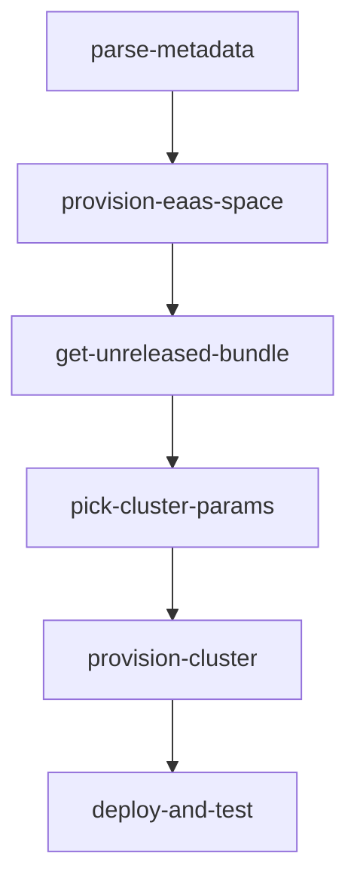
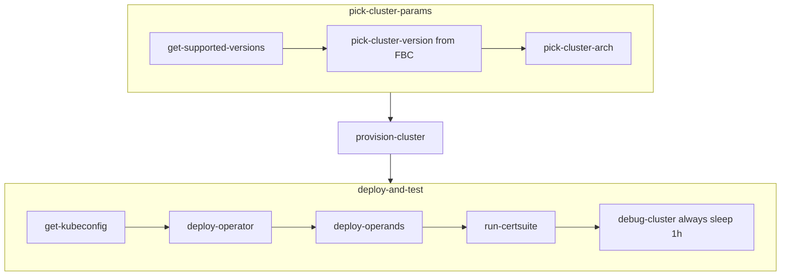
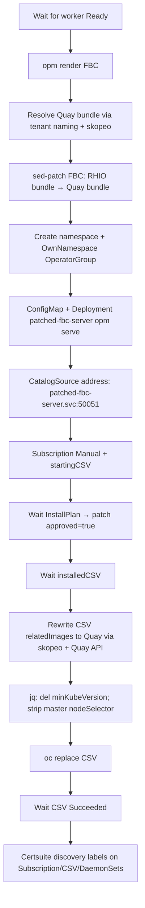
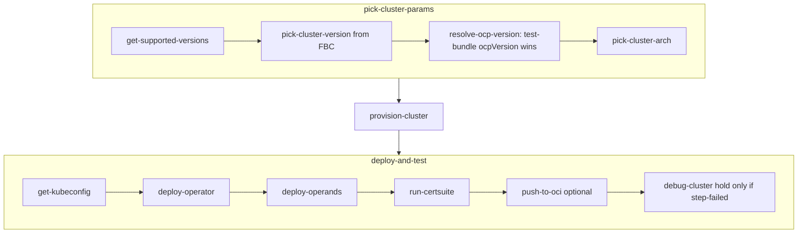
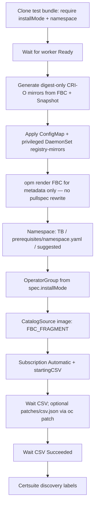
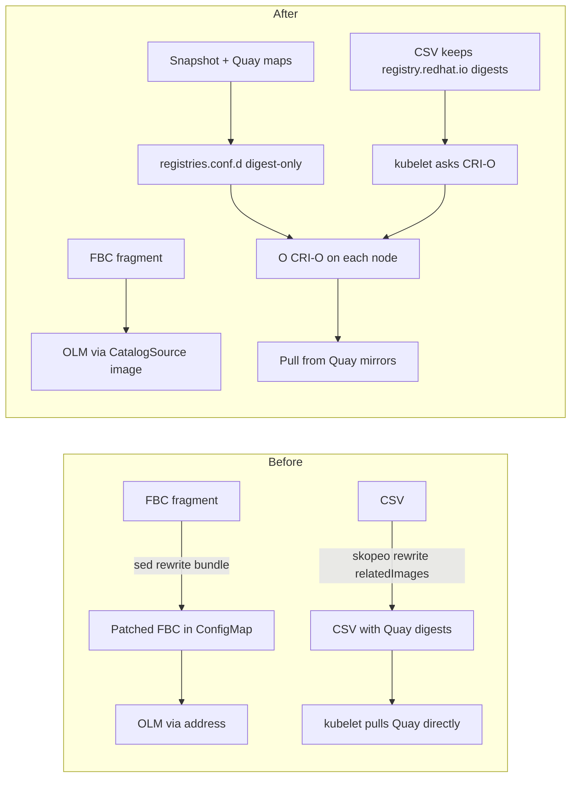

# EaaS Operator Deploy: Before vs After `2cd9163`

This document compares how konflux-certsuite installs and tests an operator
on HyperShift/EaaS **before** and **after** commit
[`2cd9163`](https://github.com/edcdavid/konflux-certsuite/commit/2cd9163a08bc25c92f7ce7cb4207b197b70c0ee1)
(*Use plain OLM with auto-generated CRI-O mirrors for EaaS certsuite*).

| | |
|---|---|
| **Before** | `ccb298f` — patched FBC catalog + in-place CSV image rewrites |
| **After** | `2cd9163` — plain OLM CatalogSource image + CRI-O digest mirrors |

Primary pipeline file in both eras:

`pipelines/certsuite-operator-test/0.1/certsuite-operator-test-eaas.yaml`

---

## Executive summary

| Concern | Before | After |
|---------|--------|-------|
| Where remapping happens | **Inside** FBC + CSV objects (rewrite pullspecs) | **At the node** (CRI-O `registries.conf.d` mirrors) |
| CatalogSource | gRPC **address** to in-cluster `opm serve` of a patched FBC | gRPC **image** = original FBC fragment |
| InstallPlan | `Manual` + explicit approve | `Automatic` |
| OperatorGroup | Hardcoded OwnNamespace | From test-bundle `spec.installMode` |
| OCP guest version | FBC ∩ EaaS supported only (silent downgrade possible) | Test-bundle `spec.ocpVersion` preferred (fail if unsupported) |
| CSV tweaks | Pipeline always rewrote images + dropped `minKubeVersion` / master selector | Optional `patches/csv.json` only (no image rewrite) |
| Results | Printed in-log only | Optional OCI push (`OCI_REF` + secret) |
| Debug hold | Always 1 hour | Only when a prior step failed |

Neither approach uses HyperShift `imageContentSources`, IDMS, or ICSP on the
guest. Remapping is either object rewrite (before) or node-local CRI-O mirrors
(after).

---

## Shared outer pipeline (both eras)

These stages are structurally the same before and after. Differences appear
inside `pick-cluster-params` and especially `deploy-and-test`.



| Stage | Purpose |
|-------|---------|
| `parse-metadata` | Read Konflux Snapshot → FBC image (`component-container-image`) |
| `provision-eaas-space` | Allocate an EaaS space for this PipelineRun |
| `get-unreleased-bundle` | Resolve unreleased bundle, package, channel from the FBC |
| `pick-cluster-params` | Choose OCP minor + arch for HyperShift |
| `provision-cluster` | Create ephemeral HyperShift AWS guest (`ClusterTemplateInstance`) |
| `deploy-and-test` | Kubeconfig → install operator → operands → certsuite → (after) OCI |

---

## BEFORE workflow (`ccb298f`)

### Mental model

> Make the **catalog and CSV look like Quay** so OLM and kubelet pull
> Konflux digests directly. Do not rely on cluster-level registry mirrors.



### Params

`SNAPSHOT`, `TEST_BUNDLE_REF`, `CERTSUITE_LABELS`, `PACKAGE_NAME`, `CHANNEL_NAME`

No `OCI_REF` / `CREDENTIALS_SECRET_NAME`. Comment in pipeline: ITS lacks
pipeline workspace bindings for a separate `collect-results` task.

### Stage detail: `pick-cluster-params` (before)

1. **`get-supported-versions`** — Read EaaS hub
   `ConfigMap/supported-versions` in `hypershift` (e.g. `4.21 4.20 …`).
2. **`pick-cluster-version`** — Derive FBC target OCP from fragment base-image
   annotation. If that minor is **not** in the supported list and is **higher**
   than the max available, **silently fall back** to the highest supported
   (e.g. FBC 4.22 → provision 4.21).
3. **`pick-cluster-arch`** — Arch from FBC bundle metadata.

There is **no** test-bundle override.

### Stage detail: `deploy-operator` (before)

Numbered as the install actually ran:



| Step | What happened | Why |
|------|---------------|-----|
| 1. Wait for node | Poll until a worker is Ready | Guest must schedule catalog/operator pods |
| 2. `opm render` | Dump FBC JSON | Source catalog content |
| 3. Quay bundle resolve | Infer tenant from FBC pullspec; try `*-bundle-mono-*` / `*-bundle-*` digests with `skopeo inspect` | Konflux builds live on Quay, not `registry.redhat.io` |
| 4. **Patch FBC** | `sed` replace original bundle image with Quay digest → `fbc-patched.json` | Catalog must advertise a pullable bundle |
| 5. Namespace | From CSV suggested-namespace or generated `oo-*` | Install target |
| 6. OperatorGroup | **Always OwnNamespace** (`targetNamespaces: [ns]`) | No test-bundle `installMode` |
| 7. Patched catalog server | ConfigMap with patched FBC + Deployment/Service running `opm serve` | Serve rewritten catalog in-cluster |
| 8. CatalogSource | `sourceType: grpc`, **`spec.address`** → `patched-fbc-server.<ns>.svc:50051` | OLM talks to patched server, not the FBC image |
| 9. Subscription | `installPlanApproval: Manual`, `startingCSV` set | Control when install starts |
| 10. Approve InstallPlan | Wait for IP, `oc patch … approved=true` | Manual approval path |
| 11. Wait `installedCSV` | Subscription reports CSV name | CSV object exists |
| 12. **CSV image rewrite** | Find `registry.redhat.io/…@sha256:…` in CSV; map each digest to Quay via tenant API + `skopeo`; special-case kube-rbac-proxy; write Quay refs into CSV | Operator pods must pull from Quay |
| 13. **Hardcoded CSV surgery** | `jq` deletes `spec.minKubeVersion` and clears master `nodeSelector` | HyperShift guests often lack matching kube / master nodes |
| 14. `oc replace` CSV | Replace entire CSV object | Apply rewrites |
| 15. Wait Succeeded | Poll CSV phase | Install complete |
| 16. Certsuite labels | Patch Subscription status, label CSV / DaemonSet templates | Certsuite discovery |

### Operands, certsuite, debug (before)

1. **`deploy-operands`** — Clone `TEST_BUNDLE_REF`; apply `prerequisites/` then `operands/`; wait for readiness (limited compared to after).
2. **`run-certsuite`** — Run with bundle `certsuite_config.yml` and optional labels.
3. **`debug-cluster`** — Print kubeconfig / status; **`sleep 3600` on every run** (success or failure).

No OCI artifact push.

### Failure modes typical of the before path

- Quay digest missing → `skopeo` / FBC patch fails mid-deploy.
- Incomplete CSV rewrite → pods still pull `registry.redhat.io` and hang `ImagePullBackOff`.
- Silent OCP downgrade (4.22 FBC on 4.21 guest) → CSV `minKubeVersion` vs guest kube mismatch (partially papered over by forced `jq` delete).
- Always holding the cluster 1h slowed iteration even on green runs.

---

## AFTER workflow (`2cd9163`)

### Mental model

> Leave FBC and CSV pullspecs as **production `registry.redhat.io@sha256`**.
> Teach every node’s CRI-O to **mirror those digests to Quay** (and Snapshot
> images). Use plain OLM. Put HyperShift-only CSV tweaks in the **test bundle**.



### Params (new)

| Param | Default | Role |
|-------|---------|------|
| `OCI_REF` | `""` | `oras push` target for results tarball; empty skips |
| `CREDENTIALS_SECRET_NAME` | `""` | Tenant Secret with `.dockerconfigjson` / `oci-storage-dockerconfigjson` |

Still required: `TEST_BUNDLE_REF`. Still optional: `CERTSUITE_LABELS`,
`PACKAGE_NAME`, `CHANNEL_NAME`.

### Stage detail: `pick-cluster-params` (after)

1. **`get-supported-versions`** — Same EaaS ConfigMap.
2. **`pick-cluster-version`** — Same FBC-derived minor (may still suggest a
   fallback internally).
3. **`resolve-ocp-version`** (**new**) — Clone test bundle; read
   `spec.ocpVersion`:
   - If set **and** present in supported list → use it.
   - If set **and not** supported → **fail** with a clear error (no silent
     downgrade).
   - If unset → use FBC-picked value (legacy behavior, including possible
     fallback to highest supported).
4. **`pick-cluster-arch`** — Unchanged idea.

Operators may set `ocpVersion` (e.g. `"4.22"`) so the run fails loudly when
EaaS only offers through 4.21. The PTP example currently omits it and relies
on CSV patches for kube skew on the FBC/EaaS fallback guest.

### Stage detail: `deploy-operator` (after)



| Step | What happens | Why |
|------|--------------|-----|
| 1. Clone test bundle | Require `spec.installMode`; read `spec.namespace` | Operator-specific install contract lives in the bundle |
| 2. Wait for node | Same as before | Schedule mirrors DS + OLM pods |
| 3. **Generate mirrors** | `opm render` FBC → collect `registry.redhat.io` relatedImages from selected `olm.bundle`; resolve each digest via Snapshot index → Quay tenant/`skopeo` → kube-rbac-proxy fallback; **fail if any unresolved** | Nodes must pull RHIO digests from Quay without rewriting CSV/FBC |
| 4. **Apply mirrors** | Namespace `certsuite-registry-mirrors`, ConfigMap `99-certsuite-konflux-mirrors.conf` (`pull-from-mirror = "digest-only"`), DaemonSet `registry-mirrors` (privileged, nsenter → reload/restart CRI-O) | Cluster-wide pull remapping |
| 5. FBC metadata only | Render FBC for package/channel/CSV name/suggested-namespace | **Do not** rewrite catalog content |
| 6. Namespace | Prefer `prerequisites/namespace.yaml`, else TB namespace / suggested / generated | e.g. privileged PSA for PTP |
| 7. OperatorGroup | From `installMode`: `AllNamespaces` (empty spec) or Own/Single/Multi → `targetNamespaces` | Matches how the CSV should be installed |
| 8. CatalogSource | `sourceType: grpc`, **`spec.image: ${FBC_FRAGMENT}`** | Plain OLM against the real Konflux FBC image |
| 9. Subscription | `installPlanApproval: Automatic`, `startingCSV` | No manual InstallPlan dance |
| 10. Optional CSV patch | If `patches/csv.json` exists → `oc patch csv --type=json` (RFC 6902) once CSV appears | HyperShift-only tweaks stay in the test bundle (e.g. drop `minKubeVersion`, clear master `nodeSelector`) |
| 11. Wait Succeeded | Richer progress logs (InstallPlan, pods, events) | Debuggability |
| 12. Certsuite labels | Same discovery labeling idea | Certsuite still finds the operator |

This redesign is **EaaS-only**; the shared-cluster pipeline is unchanged.

### Operands, certsuite, OCI, debug (after)

1. **`deploy-operands`** — Skip if `/credentials/step-failed`; else apply
   prerequisites/operands and readiness checks from the test bundle.
2. **`run-certsuite`** — Skip if `step-failed`; write claims under
   `/workspace/results/<suite>/claim.json`.
3. **`push-to-oci`** (**new**) — If `OCI_REF` and `CREDENTIALS_SECRET_NAME`
   are set and claims exist:
   - `unset KUBECONFIG` (use Tekton pod SA on the **tenant** cluster)
   - Read dockerconfig from the Secret
   - `tar czf` `results/` → `oras push ${OCI_REF}`
4. **`debug-cluster`** — Always dumps kubeconfig / operator status; **`sleep
   3600` only if `step-failed`** (failed deploy/certsuite). Green runs do not
   hold the guest.

Deploy/certsuite steps use `onError: continue` plus a `step-failed` sentinel
so later steps skip work but debug still runs.

### PTP test-bundle example (after-only contract)

| Artifact | Role |
|----------|------|
| `spec.installMode: OwnNamespace` | OperatorGroup shape |
| `prerequisites/namespace.yaml` | Privileged PSA for `openshift-ptp` |
| `patches/csv.json` | Remove `minKubeVersion`; clear master `nodeSelector` |
| `operands/` | Software-only PtpConfig / PtpOperatorConfig |

---

## Side-by-side workflows

### Image remapping



| | Before | After |
|---|--------|-------|
| Catalog content | Mutated | Untouched |
| CSV relatedImages | Mutated to Quay | Untouched RHIO digests |
| Node config | Unchanged | DaemonSet injects digest-only mirrors |
| Incomplete map | Silent pull failures later | **Fail fast** at mirror generation |

### OLM install path

| | Before | After |
|---|--------|-------|
| CatalogSource | `address: patched-fbc-server…:50051` | `image: <FBC fragment>` |
| Extra pods | `patched-fbc-server` Deployment | None (OLM pulls catalog image) |
| InstallPlan | Manual + patch approve | Automatic |
| OperatorGroup | OwnNamespace only | From `spec.installMode` |

### Cluster version selection

| | Before | After |
|---|--------|-------|
| Source of truth | FBC annotation ∩ EaaS list | Test-bundle `ocpVersion` if set, else FBC |
| Unsupported higher FBC | Silent fallback to max EaaS (e.g. 4.21) | If TB pins unsupported minor → **hard fail** |
| Typical PTP pitfall | 4.22 CSV on 4.21 guest | Pin `4.22` or accept 4.21 + CSV patch safety net |

### CSV HyperShift adaptations

| | Before | After |
|---|--------|-------|
| Image rewrite | Always in pipeline | Never (mirrors handle pulls) |
| `minKubeVersion` / master selector | Always stripped in pipeline via `jq` | Only if test bundle ships `patches/csv.json` |
| Ownership | Generic pipeline logic | Operator-owned test bundle |

### Results and debug

| | Before | After |
|---|--------|-------|
| Claim storage | Logs / workspace only | Optional OCI artifact via `oras` |
| Debug hold | Always 1h | Only on failure (`step-failed`) |
| Skip chain | Weak | Failed deploy skips operands/certsuite |

---

## File map (EaaS redesign)

| Path | Role |
|------|------|
| `pipelines/…/certsuite-operator-test-eaas.yaml` | EaaS flow rewrite (mirrors, plain OLM, ocpVersion, OCI, debug) |
| `examples/ptp-operator-test-bundle/patches/csv.json` | PTP HyperShift CSV patches |
| `examples/ptp-operator-test-bundle/prerequisites/namespace.yaml` | Privileged namespace |
| `examples/integration-test-scenario-eaas.yaml` | Optional OCI ITS params |
| `docs/architecture.md`, `docs/operator-onboarding-guide.md` | Document EaaS contract |

---

## End-to-end sequence (after) — reference

```text
Snapshot (FBC + component images)
        │
        ▼
parse-metadata ──► FBC pullspec
        │
        ▼
get-unreleased-bundle ──► bundle image, package, channel
        │
        ▼
pick-cluster-params
   ├─ EaaS supported versions
   ├─ FBC target OCP
   └─ test-bundle spec.ocpVersion (preferred)
        │
        ▼
provision-cluster ──► HyperShift guest (e.g. 4.21.24 or 4.22.x)
        │
        ▼
deploy-and-test
   ├─ get-kubeconfig
   ├─ generate digest-only mirrors (FBC relatedImages ⊕ Snapshot)
   ├─ DaemonSet → CRI-O registries.conf.d on every node
   ├─ CatalogSource(image=FBC) + Subscription(Automatic)
   ├─ optional patches/csv.json
   ├─ wait CSV Succeeded
   ├─ deploy operands from test bundle
   ├─ certsuite → /workspace/results/*/claim.json
   ├─ optional oras push → OCI_REF
   └─ debug dump; hold 1h only if failed
```

---

## When to remember which era

- **Before (`ccb298f`)** answers: “How do we make OLM see Quay digests inside
  the catalog/CSV on a guest that cannot use IDMS?”
- **After (`2cd9163`)** answers: “How do we keep production RHIO pullspecs and
  still install from Konflux Quay on HyperShift, while letting each operator’s
  test bundle own install mode, OCP pin, and CSV patches?”

For operator onboarding details (test-bundle fields, PTP patch rationale), see
[operator-onboarding-guide.md](operator-onboarding-guide.md) and
[architecture.md](architecture.md).
